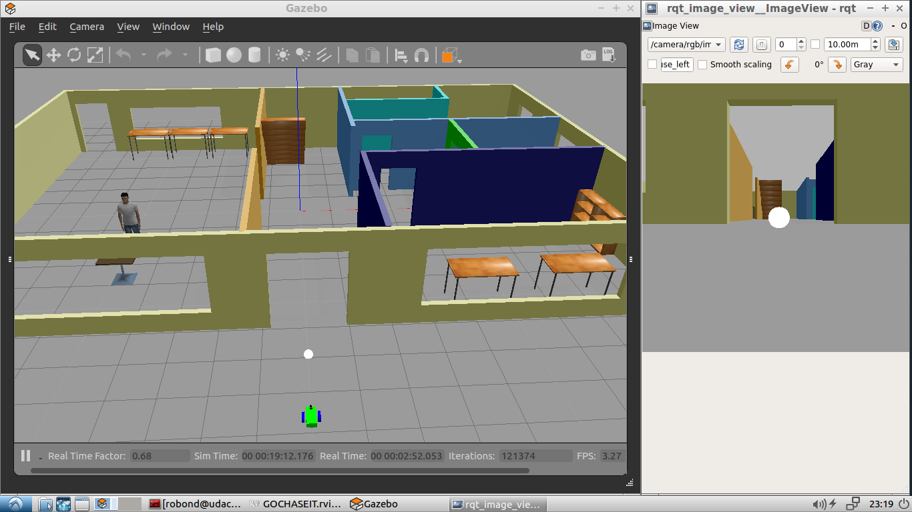
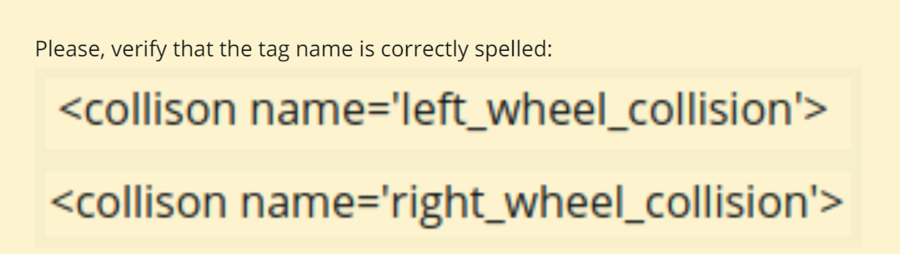
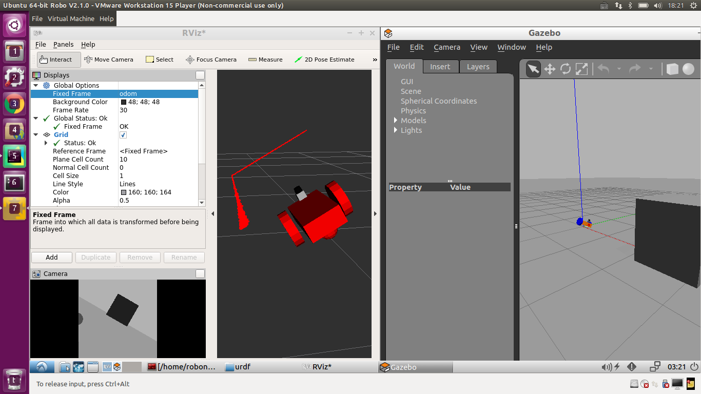
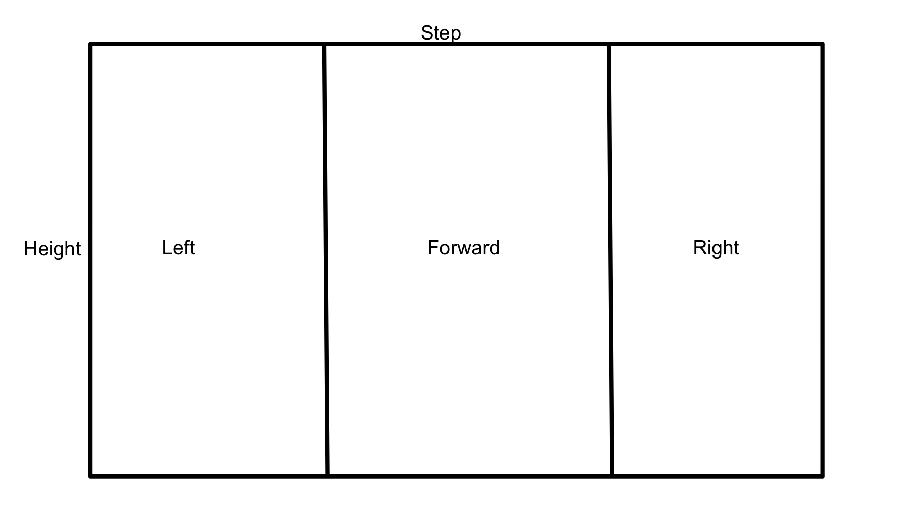

# robond-go_chase_it
## OverView 


## Build Robot Model from URDF

After finished the robot model, check syntax by `check_urdf`
```
$ check_urdf <(xacro --inorder my_robot.xacro)
```

Careful for the misspell and this caused the robot unbalanced.





## Analyzing the Images


* Known the difference between `img.width` and `img.step` . [Image Message](http://docs.ros.org/melodic/api/sensor_msgs/html/msg/Image.html)


* Known how the 3 channels images data stored


## DEMO Video: Go Chase It!

[](http://www.youtube.com/watch?v=r7r8TiZP5Z8 "Go Chase It!")
